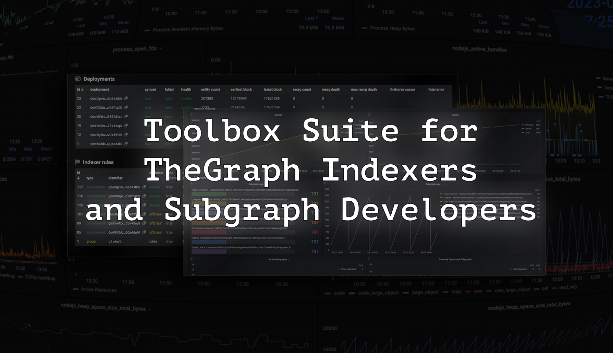

# Toolbox Suite for TheGraph Indexers and Subgraph Developers

We found that as Indexers, we need more control and monitoring, than existing tools provide. So we created a set of tools to help you monitor your subgraphs and get alerts when something goes wrong. 

### This a Monorepo consisting of the following tools:

### [Graph Queue and Indexer Status Monitor](graph-queue-monitor)

This tool allows you to monitor the Status of your Indexer and the Actions queue. It will be useful for Indexers to keep an eye on how their allocations work. It has an interface available in browser.

### [Graph Prometheus Exporter](graph-prom-exporter)

This tool allows to fetch data from subgraphs (or, actually any web sources) and export it to Prometheus. You can use it, for example, to monitor your subgraphs and get alerts when something goes wrong. Not limited to that though, you can use it to monitor any web source.

It comes with an example suite that would be a good starting point for your own monitoring.

Not limited to **Indexers**, it might be a good tool for **Subgraph developers** to monitor their subgraphs, and even for **Subgraph data consumers** to monitor the data they consume. As it is easy to extend by adding your own configs.

### [RPC Failover Proxy](rpc-failover-proxy)

This tool allows you to create a failover proxy for your RPC nodes. It will be useful for **Indexers** to have a backup proxy for their RPC nodes. Its Healthcheck algorithm ensures that blocks are progressing correctly. 

# Contributing

We welcome contributions from everyone. If you have any ideas or suggestions, please open an issue or a pull request.

# License

All tools are licensed under the MIT license.

*Developed with love and care by [ART3MIS.CLOUD](https://art3mis.cloud) for TheGraph Indexers, Subgraph Developers and data consumers.*

