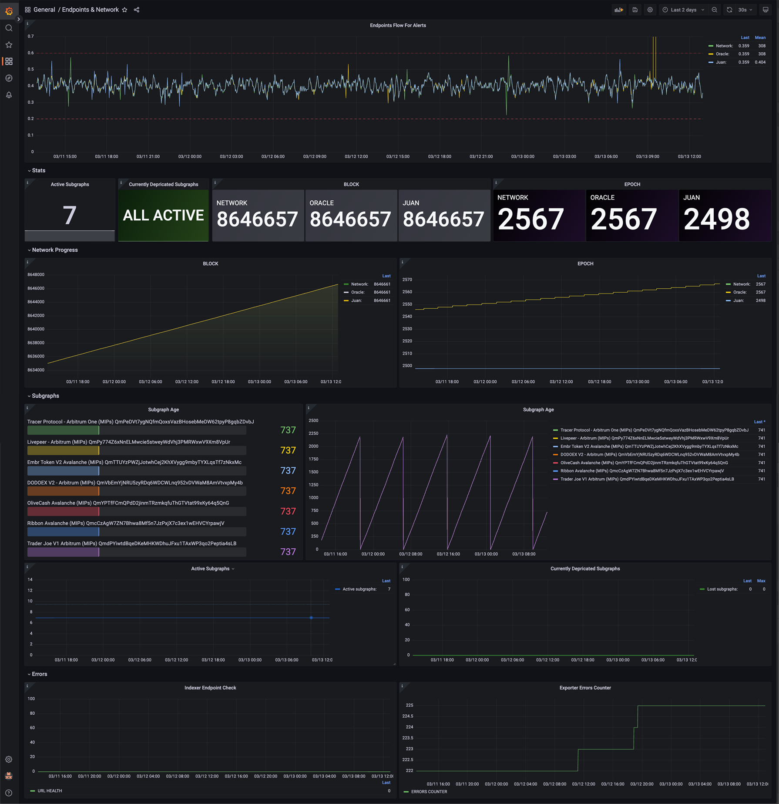

## Introduction

Highly customizible prometheus exporter for subgraphs monitoring and alerting which have no particular limitations whatsoever.
During the MIPs program we found that as Indexer, we need more control over subgraphs we are indexing, oracles subgraphs, epoch endpoint and preferible more.

_Exporter doesn't requare any access to Indexer Stack and can be deployed anywhere, requare as minimum resources as single core VPS instance. However password and key aoutentification can be easily implemented for individual needs if any._

### Graph Prometheus Exporter

Exporter fetch data from subgraphs _(or, actually any web sources)_ and expose in Prometheus format for centalized collectors as such as Grafana.
Can be used for monitoring of any web source and check things like valitidy of SSL certificates, endpoints availabilities, chains progression and even GitHub new commits and releases.

### How it works

Script goes through all the config files in the `configs` directory and makes a request to the URL specified in the config.
Then it processes the response using the callback function specified in the config. Finally, it sets the Prometheus metrics with the values returned by the callback function.

The collected Prometheus metrics can be accessed at the `/metrics` endpoint. By default, it uses 9090 port.

### Installation

Check the example configs in the `example-configs` directory. You can use them as a starting point to create your own configuration files.

To run outside of Docker, you need to have Node.js installed.

Then, run the following:

1. `npm install`
2. `cp .env.example .env`
3. Edit `.env` file and set the variables
4. Create a directory `configs` in the root folder of the project: `mkdir configs`. Copy the config files from `example-configs` to `configs` directory: `cp example-configs/*.js configs/`
5. Run the script: `npm start`

You may want to add the process to systemd or use some other process manager, like PM2.

### Use cases

Monitor subgraphs and get alerts for any available event. For example, number of entities in a subgraph and get an alert when it drops below a certain threshold. Monitor the number of entities in subgraph and get an alert when it grows above a certain threshold. Check the network health. Can use data returned by subgraphs, such as price or whatever to display it in your Grafana.

### Example configs

This directory contains example configuration files for the various use cases.
They can be used as a starting point to create your own configuration files.
Please check the `README.md` file in the `example-configs` directory for more information.

### Tests

To run the tests, run the following command: `npm test`.

### Contributing

Contributions are welcome! If you have any ideas or suggestions, please open an issue or a pull request.

### License

MIT

### How it may look in Grafana
#### (based on the example configs)

