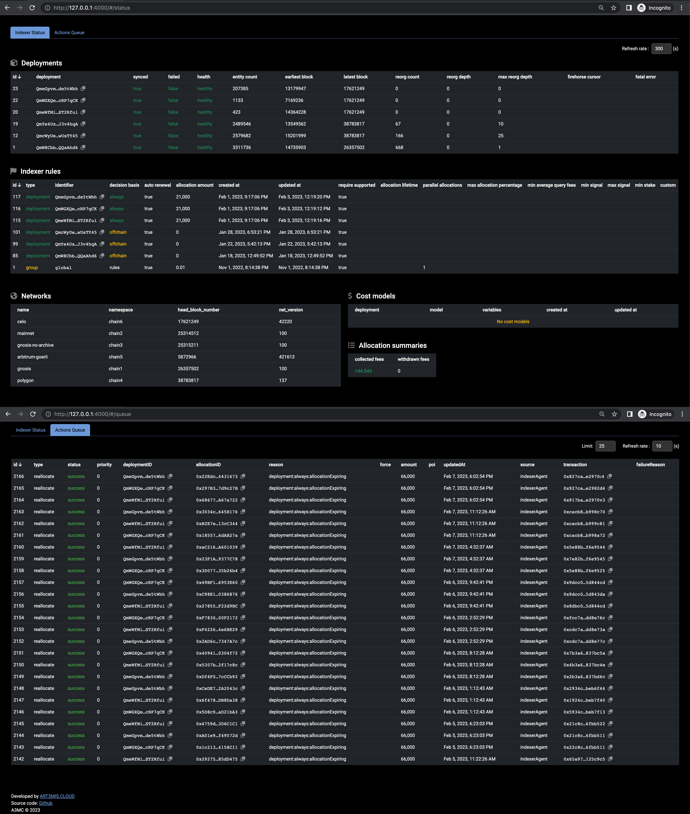

## Graph Queue and Indexer Status Monitor

Originally has been developed for advanced queue control, as we experienced multiple issues in agent events processing through MIPs program. However, the tool became more advanced and additional indexer status has been added which contains hardly visible values for better understanding, control and debugging. We didn't find any way on how to access such details in easy to read format which can be always available and ready for observation. 

#### Live Demo

You can find a working demo of the tool here: https://demo31.art3mis.net Please bear in mind that the demo site is just to demonstrate the UI and doesn't load any realtime data. You have to install your own instance.

#### How it works

The tool is a simple Node.js server (coupled with a frontend) that connects to Agent DB and Graph Node DB and displays some overview of the Indexer status and Actions queue in a browser. It can be run locally or deployed to a server. We strongly recommend not to expose it publicly. Even though it only makes read-only "SELECT" queries, publicly exposing such tools goes against best practices.

#### How to run

_Create a separate user with read-only access to the database or reuse Agent_db user in test environment._

1. Clone the repo and create a `.env` file in the root directory. `example.env ` is provided as a template.
2. Fill in the values for the variables in `.env` file.

Docker:
```sh
$ docker build -t graph-queue-monitor .
```
```sh
$ docker run --restart=unless-stopped --name graph-queue-monitor -p 3111:3111 -d graph-queue-monitor
```
Without docker:

Install Node.js 16x and npm. Run `npm i && npm start` to start the service. By default, interface runs on port `3111` and if env variables are configured correctly, you'll be able to see the queue somewhere around http://localhost:3111

_Make sure docker can access Postgres. There are too many variations of deployment, please think about solution which is applicable to your stack architecture._

#### Frontend part

The frontend part is a simple Angular app that displays the overview and queue in a table and periodically refreshes it. It is already prebuilt, but if you want you can compile it from the `/frontend` directory.

#### How it looks


