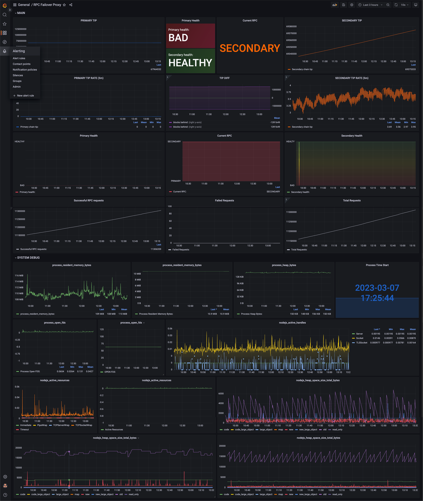

# RPC Proxy Server with Failover Capability
We've developed this tool to help the Graph Protocol community achieve a better sustainability of the RPC nodes connections. It is a Node.js proxy server that is capable of switching between primary and fail-over RPC nodes. It is designed to ensure that requests are still handled even if the primary node goes down, and to automatically switch back to the primary node when it becomes available again.

### Installation

1. Install the required packages: `npm install`

2. Create an `.env` file and fill in the necessary environment variables (see below).

3. Start the server: `node .`

### Configuration
The following environment variables are required for the server to function properly:
```
PORT: The port number for the server to listen on.
METRICS_PORT: The port number for the Prometheus metrics server to listen on.
TIMEOUT: The timeout value (in milliseconds) for RPC requests.
PRIMARY_NODE_URL: The URL for the primary RPC node.
FAILOVER_NODE_URL: The URL for the failover RPC node.
DEBUG_LEVEL: The debug level for the server. Valid values are: 'error', 'warn', 'info', 'debug'.
SHUTDOWN_TIMEOUT: Graceful shutdown timeout (in milliseconds).
HEALTHCHECK_INTERVAL: The interval (in milliseconds) for the healthcheck. Depends on the chain you use. It's recommeded to have it larger than block time, so the script knows that blocks are progressing with each call.
```

### Usage
Once the server is running, you can send requests to it with the RPC call parameters. The server will automatically handle switching between the primary and failover nodes as necessary.
Headers will be proxied as is.

The server also exposes a `/metrics` endpoint that returns Prometheus metrics for monitoring and analysis.

### Grafana Dashboard example


### Contributing
Contributions are welcome! If you find a bug or have an idea for an improvement, please open an issue or submit a pull request.

### License
This project is licensed under the MIT License.
